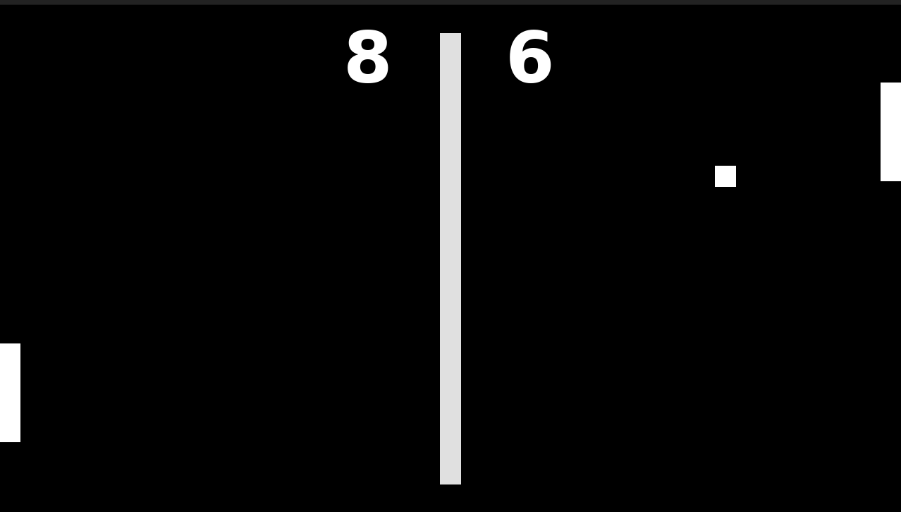

Pong
====

## Pong on C++/SDL

### Screenshot



### Control

| Key | Action |
|---|---|
| Arrow UP,   W | go top    |
| Arrow DOWN, S | go bottom |
| Escape        | exit      |

### Build

```bash
git clone https://github.com/17seannnn/pong
cd pong/src
make
./pong
```

### Dependencies

- SDL2
- SDL\_image
